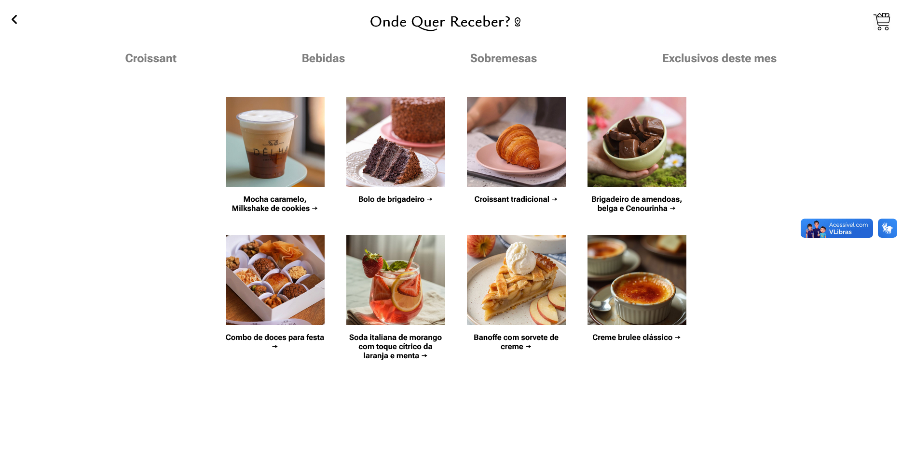

# Site do Café Pontes 🍴👋
O site do Café Pontes é uma plataforma online completa, projetada para proporcionar uma experiência excepcional aos clientes do café. O site apresenta um design moderno e responsivo, permitindo que os usuários naveguem e acessem facilmente várias seções, incluindo o menu, a área de entrega e a página "Sobre nós". O site foi desenvolvido usando uma combinação de HTML, CSS e JavaScript, e integra-se com bibliotecas e frameworks externos para fornecer recursos de acessibilidade e funcionalidade de processamento de pagamentos.

## 🚀 Recursos
O site do Café Pontes oferece os seguintes recursos principais:
* Barra de navegação com links para o menu, área de entrega e logotipo
* Banner com botão de chamada para ação
* Seção de itens em destaque com produtos exclusivos
* Seção "Sobre nós" com informações sobre o café
* Recursos de acessibilidade usando o plugin VLibras
* Funcionalidade de processamento de pagamentos usando gateways de pagamento externos
* Exibição do menu com descrições e preços dos itens
* Resumo do pedido e processamento de pagamento

## 🛠️ Tecnologias
O site do Café Pontes foi desenvolvido usando as seguintes tecnologias:
* HTML5
* CSS3
* Plugin de acessibilidade VLibras
* Sistema de gerenciamento de banco de dados MySQL
* Arquivos CSS para estilização e funcionalidade

## 📦 Instalação
Para configurar o site do Café Pontes, siga estas etapas:
### Pré-requisitos
* Instale o sistema de gerenciamento de banco de dados MySQL
* Instale o Node.js e o npm
* Instale as dependências necessárias usando npm
### Instalação
* Clone o repositório usando o git
* Execute `npm install` para instalar as dependências
* Execute `npm start` para iniciar o servidor de desenvolvimento
### Executando localmente
* Abra um navegador e acesse `http://localhost:3000`

## 💻 Uso
Para usar o site do Café Pontes, basta acessar o site e seguir estes passos:
* Clique na barra de navegação para acessar as diferentes seções do site
* Navegue pelo menu e selecione os itens que deseja pedir
* Prossiga para a página de finalização da compra para concluir o processo de pagamento

## 📂 Estrutura do Projeto
```markdown
├── index.html
├── cardapio.html
├── checkout.html
├── SQL
│ ├── _localhost-2026_04_21_21_24_12-dump.sql
├── css
│ ├── style.css
├── js
│ ├── script.js
├── node_modules
├── package.json
```

## 📸 Capturas de tela


